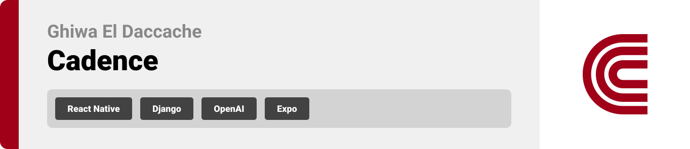
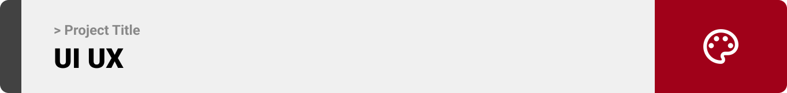
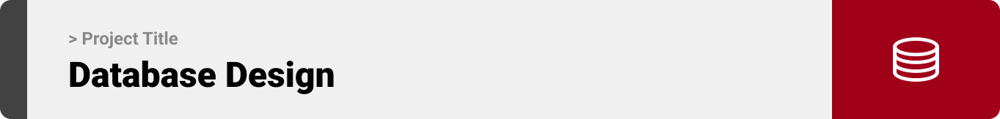

<br><br>

<!-- project philosophy -->


> A mobile app that tracks the runner's pace, then matches it with the music's BPM (Beats Per Minute).
> Cadence transforms your running experience by syncing your pace with the beats of your favorite music. With real-time tracking of your running data, the app ensures that every stride aligns with the rhythm, enhancing performance and adding a sense of enjoyment to your runs.

### User Stories
- As a user, I want to be able to listen to music according to my pace, so that the music matches my rhythm without having to take care of it manually.
- As a user, I want to customize my music playlist based on my planned pace, so I can manage my energy and performance during different stages of my run.
- As a user, I want to follow my running plan, so I have multiple custom playlists, each tailored to a different running scenario. 

<br><br>
<!-- Tech stack -->


###  Cadence is built using the following technologies:

- This project uses the [React Native development framework](https://reactnative.dev/). React Native lets you create truly native apps and doesn't compromise your users' experiences, and it brings the React programming paradigm to platforms like Android and iOS.
- This project uses the [Django framework](https://www.djangoproject.com/) for backend development. Django is a powerful tool for Python web development, handling routing, database management, authentication, and API creation. It helps developers build sturdy and scalable server-side applications with ease.
- For persistent storage, the app uses [Secure Store](https://docs.expo.dev/versions/latest/sdk/securestore/), allowing data to be stored locally on the device.
- To track the runner's pace, the app uses the [Expo Location](https://docs.expo.dev/versions/latest/sdk/location/) library which supports both Android, and iOS.
- To enhance user experience, the app uses an [OpenAI](https://openai.com/) endpoint, leveraging the capabilities of the gpt-3.5-turbo-instruct model. This AI-driven feature provides users with assistance on their runs, progress, and cadence.
- To play music, Cadence uses [Spotify](https://developer.spotify.com/documentation/web-api) APIs to get music data, create playlists, get songs recommendations, and most importantly play music. 

<br><br>
<!-- UI UX -->



> Cadence was designed using wireframes and mockup design, enhancing its layouts to ensure a better user experience through seamless navigation throughout the app.

- Project Figma design [figma](https://www.figma.com/file/T9MjW9gu1uMtYyuyOqIwVY/Cadence?type=design&node-id=0%3A1&mode=design&t=wST7djII7pj7t0rf-1)


### Mockups
| Landing screen  | Run Screen | Profile Screen |
| ---| ---| ---|
|  |  |  |

<br><br>

<!-- Database Design -->


###  Architecting Data Excellence: Innovative Database Design Strategies:

- Insert ER Diagram here


<br><br>


<!-- Implementation -->


### User Screens (Mobile)
| Login screen  | Register screen | Landing screen | Loading screen |
| ---| ---| ---| ---|
|  |  |  |  |
| Home screen  | Menu Screen | Order Screen | Checkout Screen |
|  |  |  |  |

### Admin Screens (Web)
| Login screen  | Register screen |  Landing screen |
| ---| ---| ---|
|  |  |  |
| Home screen  | Menu Screen | Order Screen |
|  |  |  |

<br><br>


<!-- Prompt Engineering -->


###  Mastering AI Interaction: Unveiling the Power of Prompt Engineering:

- This project uses advanced prompt engineering techniques to optimize the interaction with natural language processing models. By skillfully crafting input instructions, we tailor the behavior of the models to achieve precise and efficient language understanding and generation for various tasks and preferences.

<br><br>

<!-- AWS Deployment -->


###  Efficient AI Deployment: Unleashing the Potential with AWS Integration:

- This project leverages AWS deployment strategies to seamlessly integrate and deploy natural language processing models. With a focus on scalability, reliability, and performance, we ensure that AI applications powered by these models deliver robust and responsive solutions for diverse use cases.

<br><br>

<!-- Unit Testing -->


###  Precision in Development: Harnessing the Power of Unit Testing:

- This project employs rigorous unit testing methodologies to ensure the reliability and accuracy of code components. By systematically evaluating individual units of the software, we guarantee a robust foundation, identifying and addressing potential issues early in the development process.

<br><br>


<!-- How to run -->


> To set up Cadence locally, follow these steps:

### Prerequisites

This is an example of how to list things you need to use the software and how to install them.
* npm
  ```sh
  npm install npm@latest -g
  ```

### Installation

_Below is an example of how you can instruct your audience on installing and setting up your app. This template doesn't rely on any external dependencies or services._

1. Get a free API Key at [example](https://example.com)
2. Clone the repo
   git clone [github](https://github.com/GhiwaDaccache/cadence)
3. Install NPM packages
   ```sh
   npm install
   ```
4. Enter your API in `config.js`
   ```js
   const API_KEY = 'ENTER YOUR API';
   ```

Now, you should be able to run Cadence locally and explore its features.
