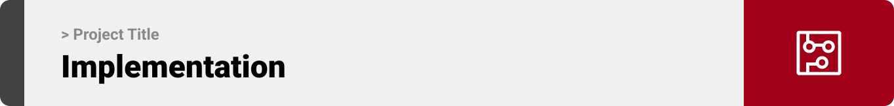
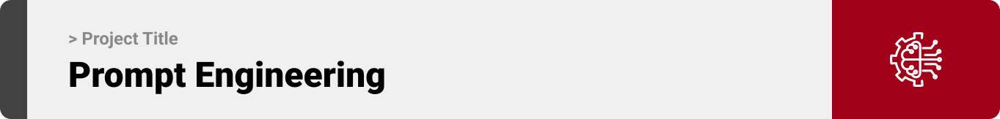
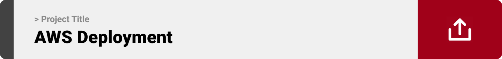
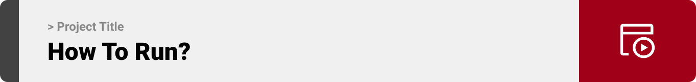

<br><br>

<!-- project philosophy -->


> A mobile app that takes live data from a running tracker, then plays music with a BPM (Beats Per Minute) matching the runner's pace.
>
> Cadence revolutionizes your runs by integrating live data from your tracker with dynamic music playback. Our app ensures that every stride is perfectly synced with the rhythm, enhancing motivation and performancence. 

### User Stories
- As a user, I want to be able to listen to music according to my pace, so that the music matches my rhythm without having to take care of it manually.
- As a user, I want to customize my music playlist based on my planned pace, so I can manage my energy and performance during different stages of my run.
- As a user, I want to create multiple custom playlists, each tailored to different running scenarios, so I can follow my running plan through playlists. 

<br><br>
<!-- Tech stack -->


###  Cadence is built using the following technologies:

- This project uses the [Flutter app development framework](https://flutter.dev/). Flutter is a cross-platform hybrid app development platform which allows us to use a single codebase for apps on mobile, desktop, and the web.
- For persistent storage (database), the app uses the [Hive](https://hivedb.dev/) package which allows the app to create a custom storage schema and save it to a local database.
- To send local push notifications, the app uses the [flutter_local_notifications](https://pub.dev/packages/flutter_local_notifications) package which supports Android, iOS, and macOS.
- The app uses the font ["Urbanist"](https://fonts.google.com/specimen/Urbanist?stroke=Sans+Serif&subset=latin&noto.script=Latn) as its main font, and the design of the app adheres to the material design guidelines.

<br><br>
<!-- UI UX -->


> Cadence was designed through wireframing and mockup design, enhancing its layouts to ensure a better user experience.

- Project Figma design [figma](https://www.figma.com/file/T9MjW9gu1uMtYyuyOqIwVY/Cadence?type=design&node-id=0%3A1&mode=design&t=wST7djII7pj7t0rf-1)


### Mockups
| Home screen  | Menu Screen | Order Screen |
| ---| ---| ---|
|  |  |  |

<br><br>

<!-- Database Design -->


###  Architecting Data Excellence: Innovative Database Design Strategies:

- Insert ER Diagram here


<br><br>


<!-- Implementation -->



### User Screens (Mobile)
| Login screen  | Register screen | Landing screen | Loading screen |
| ---| ---| ---| ---|
|  |  |  |  |
| Home screen  | Menu Screen | Order Screen | Checkout Screen |
|  |  |  |  |

### Admin Screens (Web)
| Login screen  | Register screen |  Landing screen |
| ---| ---| ---|
|  |  |  |
| Home screen  | Menu Screen | Order Screen |
|  |  |  |

<br><br>


<!-- Prompt Engineering -->


###  Mastering AI Interaction: Unveiling the Power of Prompt Engineering:

- This project uses advanced prompt engineering techniques to optimize the interaction with natural language processing models. By skillfully crafting input instructions, we tailor the behavior of the models to achieve precise and efficient language understanding and generation for various tasks and preferences.

<br><br>

<!-- AWS Deployment -->


###  Efficient AI Deployment: Unleashing the Potential with AWS Integration:

- This project leverages AWS deployment strategies to seamlessly integrate and deploy natural language processing models. With a focus on scalability, reliability, and performance, we ensure that AI applications powered by these models deliver robust and responsive solutions for diverse use cases.

<br><br>

<!-- Unit Testing -->


###  Precision in Development: Harnessing the Power of Unit Testing:

- This project employs rigorous unit testing methodologies to ensure the reliability and accuracy of code components. By systematically evaluating individual units of the software, we guarantee a robust foundation, identifying and addressing potential issues early in the development process.

<br><br>


<!-- How to run -->


> To set up Cadence locally, follow these steps:

### Prerequisites

This is an example of how to list things you need to use the software and how to install them.
* npm
  ```sh
  npm install npm@latest -g
  ```

### Installation

_Below is an example of how you can instruct your audience on installing and setting up your app. This template doesn't rely on any external dependencies or services._

1. Get a free API Key at [example](https://example.com)
2. Clone the repo
   git clone [github](https://github.com/your_username_/Project-Name.git)
3. Install NPM packages
   ```sh
   npm install
   ```
4. Enter your API in `config.js`
   ```js
   const API_KEY = 'ENTER YOUR API';
   ```

Now, you should be able to run Cadence locally and explore its features.
